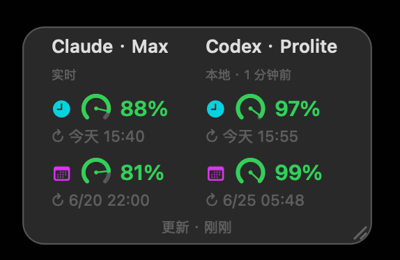
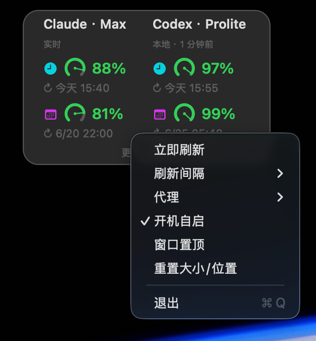

# QuotaCard

> 一个常驻 macOS 桌面的小卡片，实时显示 **Claude** 与 **Codex** 的额度（5 小时 / 7 天窗口剩余）。
> A lightweight macOS desktop widget that shows your **Claude** & **Codex** usage limits at a glance.

纯 Swift + AppKit，单文件、无第三方框架；数据由随附的独立 Python 脚本在本机抓取。**不上传任何数据**，只读你本机已有的浏览器登录态和本地日志。

<p align="center">
        

  
</p>

## 特性

- **两个服务并排**：Claude（左）/ Codex（右），各显示 5h（🕐）与 7d（📅）两个窗口
- **动态油量表**：指针随剩余百分比转动，绿（≥40%）/ 黄（20–40%）/ 红（<20%）
- **桌面常驻**：贴在桌面、不抢焦点；切到全屏 app 不跟过去、不遮挡前台
- **自由拖动 / 缩放**：拖卡片移动，拖边或角缩放，内容等比适配、位置大小记住
- **右键设置**：刷新间隔（1/2/4 小时）、代理、开机自启、窗口置顶、立即刷新
- **抓不到时不空白**：Cloudflare 偶发拦截 Claude 时显示「上次成功」值；Codex 走本地快照

## 系统要求

- macOS 13+
- **Xcode 命令行工具**（提供 `swiftc`）：`xcode-select --install`
- **python3**（命令行工具自带）
- 想看 **Claude** 额度：在 Chrome / Firefox 登录 [claude.ai](https://claude.ai)
- 想看 **Codex** 额度：用过 [Codex CLI](https://developers.openai.com/codex/cli)（本地 `~/.codex/sessions` 才有额度快照）

## 安装

```bash
git clone https://github.com/cn-panda/claude-codex-quota.git
cd claude-codex-quota
bash install.sh
```

`install.sh` 会：本机编译（自动匹配 Intel / Apple Silicon）→ 在 `~/Library/Application Support/QuotaCard/venv` 建 Python 环境装依赖 → 安装到 `/Applications` 并启动。

> 在「主桌面」运行安装/打开，卡片会绑定到桌面 Space。

## 使用

| 操作 | 效果 |
|---|---|
| 拖卡片中间 | 移动 |
| 拖边 / 角 | 缩放（内容等比适配） |
| 右键 | 菜单：立即刷新 / 刷新间隔 / 代理 / 开机自启 / 窗口置顶 / 重置大小位置 / 退出 |


默认 **直连**；若访问 claude.ai 需要代理，右键 → 代理 → 自定义（如 `127.0.0.1:7890`）。

## 工作原理

抓取脚本 `fetch.py`（随 app 打包到 `Contents/Resources/`，由独立 venv 运行）：

- **Claude** ← 读浏览器 cookie，请求 `claude.ai` usage API（用 `curl_cffi` 模拟 Chrome 指纹过 Cloudflare，带重试）。抓不到时回退「上次成功」缓存。
- **Codex** ← 直接读本地 `~/.codex/sessions` 最新快照（Codex CLI 每次交互写入的真实额度）。窗口过了重置点会自动推断恢复满额。

## 已知局限（诚实说明）

- **Cloudflare 间歇性拦截**：claude.ai / chatgpt.com 偶尔挑战非浏览器请求。Claude 抓不到时显示上次成功值（橙色标注）。
- **Codex 只有 CLI 本地数据**：chatgpt.com 的合并用量接口基本被 Cloudflare 封死，所以 Codex 走本地快照——只反映 **Codex CLI** 的消耗，**不含 Codex Cloud（网页）用量**；很久没用 CLI 时数据会旧（看「本地 · N 分钟前」）。
- **不读浏览器即无 Claude**：未登录 claude.ai 时 Claude 区显示错误。
- 这些是数据源本身的限制，非本工具缺陷——官方 Codex CLI 自己也是同样的数据来源。

## 隐私

只在**本机**读取：浏览器 cookie（经系统 Keychain 解密，首次会请求授权）、`~/.codex/sessions` 本地日志。不向任何第三方服务器上传数据。抓取直接发往 claude.ai / chatgpt.com 官方接口（与浏览器同源）。

## 从源码构建（开发）

```bash
bash build.sh        # 仅编译到 ./QuotaCard.app（含建 venv、生成图标）
open QuotaCard.app
```

项目结构：`Sources/main.swift`（全部 UI）、`fetch.py`（抓取）、`icon.swift`（图标生成）、`Info.plist`、`build.sh` / `install.sh`。

## 许可证

[MIT](LICENSE)
